# Architecture: mos

> Auto-generated by `mos architecture sync`. Do not edit manually.

## Components

| Component | Package |
|-----------|----------|
| cmd/internal/subsystem | `github.com/dpopsuev/mos/cmd/internal/subsystem` |
| cmd/internal/wire | `github.com/dpopsuev/mos/cmd/internal/wire` |
| cmd/mgate | `github.com/dpopsuev/mos/cmd/mgate` |
| cmd/mgov | `github.com/dpopsuev/mos/cmd/mgov` |
| cmd/mos | `github.com/dpopsuev/mos/cmd/mos` |
| cmd/mos/binder | `github.com/dpopsuev/mos/cmd/mos/binder` |
| cmd/mos/ci | `github.com/dpopsuev/mos/cmd/mos/ci` |
| cmd/mos/cliutil | `github.com/dpopsuev/mos/cmd/mos/cliutil` |
| cmd/mos/config | `github.com/dpopsuev/mos/cmd/mos/config` |
| cmd/mos/contract | `github.com/dpopsuev/mos/cmd/mos/contract` |
| cmd/mos/factory | `github.com/dpopsuev/mos/cmd/mos/factory` |
| cmd/mos/gatecmd | `github.com/dpopsuev/mos/cmd/mos/gatecmd` |
| cmd/mos/generic | `github.com/dpopsuev/mos/cmd/mos/generic` |
| cmd/mos/govern | `github.com/dpopsuev/mos/cmd/mos/govern` |
| cmd/mos/lexicon | `github.com/dpopsuev/mos/cmd/mos/lexicon` |
| cmd/mos/rule | `github.com/dpopsuev/mos/cmd/mos/rule` |
| cmd/mos/spec | `github.com/dpopsuev/mos/cmd/mos/spec` |
| cmd/mos/storecmd | `github.com/dpopsuev/mos/cmd/mos/storecmd` |
| cmd/mos/tracecmd | `github.com/dpopsuev/mos/cmd/mos/tracecmd` |
| cmd/mos/vcscmd | `github.com/dpopsuev/mos/cmd/mos/vcscmd` |
| cmd/mstore | `github.com/dpopsuev/mos/cmd/mstore` |
| cmd/mtrace | `github.com/dpopsuev/mos/cmd/mtrace` |
| cmd/mvcs | `github.com/dpopsuev/mos/cmd/mvcs` |
| moslib/arch | `github.com/dpopsuev/mos/moslib/arch` |
| moslib/artifact | `github.com/dpopsuev/mos/moslib/artifact` |
| moslib/artifact/chain | `github.com/dpopsuev/mos/moslib/artifact/chain` |
| moslib/clone | `github.com/dpopsuev/mos/moslib/clone` |
| moslib/dsl | `github.com/dpopsuev/mos/moslib/dsl` |
| moslib/dsl/antlrgen | `github.com/dpopsuev/mos/moslib/dsl/antlrgen` |
| moslib/governance | `github.com/dpopsuev/mos/moslib/governance` |
| moslib/governance/audit | `github.com/dpopsuev/mos/moslib/governance/audit` |
| moslib/governance/chain | `github.com/dpopsuev/mos/moslib/governance/chain` |
| moslib/guard | `github.com/dpopsuev/mos/moslib/guard` |
| moslib/harness | `github.com/dpopsuev/mos/moslib/harness` |
| moslib/linter | `github.com/dpopsuev/mos/moslib/linter` |
| moslib/lsp | `github.com/dpopsuev/mos/moslib/lsp` |
| moslib/mesh | `github.com/dpopsuev/mos/moslib/mesh` |
| moslib/mesh/export | `github.com/dpopsuev/mos/moslib/mesh/export` |
| moslib/model | `github.com/dpopsuev/mos/moslib/model` |
| moslib/names | `github.com/dpopsuev/mos/moslib/names` |
| moslib/primitive | `github.com/dpopsuev/mos/moslib/primitive` |
| moslib/registry | `github.com/dpopsuev/mos/moslib/registry` |
| moslib/schema | `github.com/dpopsuev/mos/moslib/schema` |
| moslib/store | `github.com/dpopsuev/mos/moslib/store` |
| moslib/survey | `github.com/dpopsuev/mos/moslib/survey` |
| moslib/topology | `github.com/dpopsuev/mos/moslib/topology` |
| moslib/vcs | `github.com/dpopsuev/mos/moslib/vcs` |
| moslib/vcs/history | `github.com/dpopsuev/mos/moslib/vcs/history` |
| moslib/vcs/merge | `github.com/dpopsuev/mos/moslib/vcs/merge` |
| moslib/vcs/staging | `github.com/dpopsuev/mos/moslib/vcs/staging` |
| moslib/vcs/transport | `github.com/dpopsuev/mos/moslib/vcs/transport` |

## Dependency Graph

```mermaid
graph TD
    cmd_internal_subsystem["cmd/internal/subsystem\n(github.com/dpopsuev/mos/cmd/internal/subsystem)"]
    cmd_internal_wire["cmd/internal/wire\n(github.com/dpopsuev/mos/cmd/internal/wire)"]
    cmd_mgate["cmd/mgate\n(github.com/dpopsuev/mos/cmd/mgate)"]
    cmd_mgov["cmd/mgov\n(github.com/dpopsuev/mos/cmd/mgov)"]
    cmd_mos["cmd/mos\n(github.com/dpopsuev/mos/cmd/mos)"]
    cmd_mos_binder["cmd/mos/binder\n(github.com/dpopsuev/mos/cmd/mos/binder)"]
    cmd_mos_ci["cmd/mos/ci\n(github.com/dpopsuev/mos/cmd/mos/ci)"]
    cmd_mos_cliutil["cmd/mos/cliutil\n(github.com/dpopsuev/mos/cmd/mos/cliutil)"]
    cmd_mos_config["cmd/mos/config\n(github.com/dpopsuev/mos/cmd/mos/config)"]
    cmd_mos_contract["cmd/mos/contract\n(github.com/dpopsuev/mos/cmd/mos/contract)"]
    cmd_mos_factory["cmd/mos/factory\n(github.com/dpopsuev/mos/cmd/mos/factory)"]
    cmd_mos_gatecmd["cmd/mos/gatecmd\n(github.com/dpopsuev/mos/cmd/mos/gatecmd)"]
    cmd_mos_generic["cmd/mos/generic\n(github.com/dpopsuev/mos/cmd/mos/generic)"]
    cmd_mos_govern["cmd/mos/govern\n(github.com/dpopsuev/mos/cmd/mos/govern)"]
    cmd_mos_lexicon["cmd/mos/lexicon\n(github.com/dpopsuev/mos/cmd/mos/lexicon)"]
    cmd_mos_rule["cmd/mos/rule\n(github.com/dpopsuev/mos/cmd/mos/rule)"]
    cmd_mos_spec["cmd/mos/spec\n(github.com/dpopsuev/mos/cmd/mos/spec)"]
    cmd_mos_storecmd["cmd/mos/storecmd\n(github.com/dpopsuev/mos/cmd/mos/storecmd)"]
    cmd_mos_tracecmd["cmd/mos/tracecmd\n(github.com/dpopsuev/mos/cmd/mos/tracecmd)"]
    cmd_mos_vcscmd["cmd/mos/vcscmd\n(github.com/dpopsuev/mos/cmd/mos/vcscmd)"]
    cmd_mstore["cmd/mstore\n(github.com/dpopsuev/mos/cmd/mstore)"]
    cmd_mtrace["cmd/mtrace\n(github.com/dpopsuev/mos/cmd/mtrace)"]
    cmd_mvcs["cmd/mvcs\n(github.com/dpopsuev/mos/cmd/mvcs)"]
    moslib_arch["moslib/arch\n(github.com/dpopsuev/mos/moslib/arch)"]
    moslib_artifact["moslib/artifact\n(github.com/dpopsuev/mos/moslib/artifact)"]
    moslib_artifact_chain["moslib/artifact/chain\n(github.com/dpopsuev/mos/moslib/artifact/chain)"]
    moslib_clone["moslib/clone\n(github.com/dpopsuev/mos/moslib/clone)"]
    moslib_dsl["moslib/dsl\n(github.com/dpopsuev/mos/moslib/dsl)"]
    moslib_dsl_antlrgen["moslib/dsl/antlrgen\n(github.com/dpopsuev/mos/moslib/dsl/antlrgen)"]
    moslib_governance["moslib/governance\n(github.com/dpopsuev/mos/moslib/governance)"]
    moslib_governance_audit["moslib/governance/audit\n(github.com/dpopsuev/mos/moslib/governance/audit)"]
    moslib_governance_chain["moslib/governance/chain\n(github.com/dpopsuev/mos/moslib/governance/chain)"]
    moslib_guard["moslib/guard\n(github.com/dpopsuev/mos/moslib/guard)"]
    moslib_harness["moslib/harness\n(github.com/dpopsuev/mos/moslib/harness)"]
    moslib_linter["moslib/linter\n(github.com/dpopsuev/mos/moslib/linter)"]
    moslib_lsp["moslib/lsp\n(github.com/dpopsuev/mos/moslib/lsp)"]
    moslib_mesh["moslib/mesh\n(github.com/dpopsuev/mos/moslib/mesh)"]
    moslib_mesh_export["moslib/mesh/export\n(github.com/dpopsuev/mos/moslib/mesh/export)"]
    moslib_model["moslib/model\n(github.com/dpopsuev/mos/moslib/model)"]
    moslib_names["moslib/names\n(github.com/dpopsuev/mos/moslib/names)"]
    moslib_primitive["moslib/primitive\n(github.com/dpopsuev/mos/moslib/primitive)"]
    moslib_registry["moslib/registry\n(github.com/dpopsuev/mos/moslib/registry)"]
    moslib_schema["moslib/schema\n(github.com/dpopsuev/mos/moslib/schema)"]
    moslib_store["moslib/store\n(github.com/dpopsuev/mos/moslib/store)"]
    moslib_survey["moslib/survey\n(github.com/dpopsuev/mos/moslib/survey)"]
    moslib_topology["moslib/topology\n(github.com/dpopsuev/mos/moslib/topology)"]
    moslib_vcs["moslib/vcs\n(github.com/dpopsuev/mos/moslib/vcs)"]
    moslib_vcs_history["moslib/vcs/history\n(github.com/dpopsuev/mos/moslib/vcs/history)"]
    moslib_vcs_merge["moslib/vcs/merge\n(github.com/dpopsuev/mos/moslib/vcs/merge)"]
    moslib_vcs_staging["moslib/vcs/staging\n(github.com/dpopsuev/mos/moslib/vcs/staging)"]
    moslib_vcs_transport["moslib/vcs/transport\n(github.com/dpopsuev/mos/moslib/vcs/transport)"]
    cmd_internal_subsystem -->|"import(1)"| cmd_mos_binder
    cmd_internal_subsystem -->|"import(1)"| cmd_mos_ci
    cmd_internal_subsystem -->|"import(1)"| cmd_mos_config
    cmd_internal_subsystem -->|"import(2)"| cmd_mos_contract
    cmd_internal_subsystem -->|"import(5)"| cmd_mos_gatecmd
    cmd_internal_subsystem -->|"import(1)"| cmd_mos_generic
    cmd_internal_subsystem -->|"import(14)"| cmd_mos_govern
    cmd_internal_subsystem -->|"import(1)"| cmd_mos_lexicon
    cmd_internal_subsystem -->|"import(1)"| cmd_mos_rule
    cmd_internal_subsystem -->|"import(1)"| cmd_mos_spec
    cmd_internal_subsystem -->|"import(1)"| cmd_mos_storecmd
    cmd_internal_subsystem -->|"import(5)"| cmd_mos_tracecmd
    cmd_internal_subsystem -->|"import(2)"| cmd_mos_vcscmd
    cmd_internal_subsystem -->|"import(4)"| moslib_registry
    cmd_internal_wire -->|"import(13)"| moslib_artifact
    cmd_internal_wire -->|"import(17)"| moslib_linter
    cmd_internal_wire -->|"import(1)"| moslib_model
    cmd_internal_wire -->|"import(3)"| moslib_registry
    cmd_internal_wire -->|"import(1)"| moslib_schema
    cmd_internal_wire -->|"import(2)"| moslib_survey
    cmd_mgate -->|"import(1)"| cmd_internal_subsystem
    cmd_mgate -->|"import(1)"| cmd_internal_wire
    cmd_mgate -->|"import(5)"| cmd_mos_cliutil
    cmd_mgov -->|"import(1)"| cmd_internal_subsystem
    cmd_mgov -->|"import(1)"| cmd_internal_wire
    cmd_mgov -->|"import(5)"| cmd_mos_cliutil
    cmd_mos -->|"import(5)"| cmd_internal_subsystem
    cmd_mos -->|"import(1)"| cmd_internal_wire
    cmd_mos -->|"import(5)"| cmd_mos_cliutil
    cmd_mos -->|"import(2)"| moslib_lsp
    cmd_mos_binder -->|"import(7)"| cmd_mos_factory
    cmd_mos_binder -->|"import(12)"| moslib_artifact
    cmd_mos_binder -->|"import(4)"| moslib_names
    cmd_mos_binder -->|"import(5)"| moslib_registry
    cmd_mos_ci -->|"import(5)"| moslib_artifact
    cmd_mos_ci -->|"import(2)"| moslib_dsl
    cmd_mos_ci -->|"import(5)"| moslib_governance_audit
    cmd_mos_ci -->|"import(3)"| moslib_guard
    cmd_mos_ci -->|"import(7)"| moslib_mesh
    cmd_mos_ci -->|"import(4)"| moslib_names
    cmd_mos_cliutil -->|"import(2)"| moslib_artifact
    cmd_mos_cliutil -->|"import(6)"| moslib_names
    cmd_mos_cliutil -->|"import(5)"| moslib_registry
    cmd_mos_config -->|"import(15)"| moslib_registry
    cmd_mos_contract -->|"import(1)"| cmd_mos_cliutil
    cmd_mos_contract -->|"import(19)"| cmd_mos_factory
    cmd_mos_contract -->|"import(55)"| moslib_artifact
    cmd_mos_contract -->|"import(4)"| moslib_governance_chain
    cmd_mos_contract -->|"import(8)"| moslib_names
    cmd_mos_contract -->|"import(6)"| moslib_registry
    cmd_mos_factory -->|"import(1)"| cmd_mos_cliutil
    cmd_mos_factory -->|"import(23)"| moslib_artifact
    cmd_mos_factory -->|"import(3)"| moslib_names
    cmd_mos_factory -->|"import(6)"| moslib_registry
    cmd_mos_gatecmd -->|"import(2)"| cmd_mos_cliutil
    cmd_mos_gatecmd -->|"import(2)"| moslib_artifact
    cmd_mos_gatecmd -->|"import(8)"| moslib_dsl
    cmd_mos_gatecmd -->|"import(13)"| moslib_governance_audit
    cmd_mos_gatecmd -->|"import(25)"| moslib_harness
    cmd_mos_gatecmd -->|"import(16)"| moslib_linter
    cmd_mos_gatecmd -->|"import(5)"| moslib_names
    cmd_mos_generic -->|"import(16)"| cmd_mos_factory
    cmd_mos_generic -->|"import(16)"| moslib_artifact
    cmd_mos_generic -->|"import(3)"| moslib_dsl
    cmd_mos_generic -->|"import(2)"| moslib_names
    cmd_mos_generic -->|"import(4)"| moslib_registry
    cmd_mos_govern -->|"import(2)"| cmd_mos_cliutil
    cmd_mos_govern -->|"import(73)"| moslib_artifact
    cmd_mos_govern -->|"import(4)"| moslib_artifact_chain
    cmd_mos_govern -->|"import(6)"| moslib_dsl
    cmd_mos_govern -->|"import(11)"| moslib_governance_audit
    cmd_mos_govern -->|"import(1)"| moslib_harness
    cmd_mos_govern -->|"import(7)"| moslib_names
    cmd_mos_govern -->|"import(7)"| moslib_registry
    cmd_mos_lexicon -->|"import(2)"| cmd_mos_factory
    cmd_mos_lexicon -->|"import(5)"| moslib_artifact
    cmd_mos_lexicon -->|"import(3)"| moslib_names
    cmd_mos_rule -->|"import(11)"| cmd_mos_factory
    cmd_mos_rule -->|"import(24)"| moslib_artifact
    cmd_mos_rule -->|"import(4)"| moslib_names
    cmd_mos_rule -->|"import(3)"| moslib_registry
    cmd_mos_spec -->|"import(2)"| cmd_mos_cliutil
    cmd_mos_spec -->|"import(15)"| cmd_mos_factory
    cmd_mos_spec -->|"import(17)"| moslib_artifact
    cmd_mos_spec -->|"import(5)"| moslib_mesh
    cmd_mos_spec -->|"import(4)"| moslib_names
    cmd_mos_spec -->|"import(5)"| moslib_registry
    cmd_mos_storecmd -->|"import(9)"| moslib_store
    cmd_mos_tracecmd -->|"import(18)"| moslib_arch
    cmd_mos_tracecmd -->|"import(11)"| moslib_artifact
    cmd_mos_tracecmd -->|"import(9)"| moslib_clone
    cmd_mos_tracecmd -->|"import(6)"| moslib_mesh
    cmd_mos_tracecmd -->|"import(14)"| moslib_model
    cmd_mos_tracecmd -->|"import(4)"| moslib_names
    cmd_mos_tracecmd -->|"import(4)"| moslib_survey
    cmd_mos_vcscmd -->|"import(7)"| moslib_guard
    cmd_mos_vcscmd -->|"import(2)"| moslib_harness
    cmd_mos_vcscmd -->|"import(1)"| moslib_names
    cmd_mos_vcscmd -->|"import(34)"| moslib_vcs
    cmd_mos_vcscmd -->|"import(36)"| moslib_vcs_history
    cmd_mos_vcscmd -->|"import(8)"| moslib_vcs_merge
    cmd_mos_vcscmd -->|"import(26)"| moslib_vcs_staging
    cmd_mos_vcscmd -->|"import(14)"| moslib_vcs_transport
    cmd_mstore -->|"import(1)"| cmd_internal_subsystem
    cmd_mstore -->|"import(1)"| cmd_internal_wire
    cmd_mstore -->|"import(5)"| cmd_mos_cliutil
    cmd_mtrace -->|"import(1)"| cmd_internal_subsystem
    cmd_mtrace -->|"import(1)"| cmd_internal_wire
    cmd_mtrace -->|"import(5)"| cmd_mos_cliutil
    cmd_mvcs -->|"import(1)"| cmd_internal_subsystem
    cmd_mvcs -->|"import(1)"| cmd_internal_wire
    cmd_mvcs -->|"import(5)"| cmd_mos_cliutil
    moslib_arch -->|"import(21)"| moslib_dsl
    moslib_arch -->|"import(13)"| moslib_model
    moslib_arch -->|"import(7)"| moslib_registry
    moslib_artifact -->|"import(17)"| moslib_arch
    moslib_artifact -->|"import(57)"| moslib_dsl
    moslib_artifact -->|"import(5)"| moslib_harness
    moslib_artifact -->|"import(1)"| moslib_model
    moslib_artifact -->|"import(38)"| moslib_names
    moslib_artifact -->|"import(50)"| moslib_registry
    moslib_artifact -->|"import(15)"| moslib_schema
    moslib_artifact -->|"import(9)"| moslib_store
    moslib_artifact_chain -->|"import(13)"| moslib_artifact
    moslib_artifact_chain -->|"import(6)"| moslib_dsl
    moslib_clone -->|"import(16)"| moslib_dsl
    moslib_clone -->|"import(2)"| moslib_names
    moslib_clone -->|"import(8)"| moslib_registry
    moslib_governance -->|"import(3)"| moslib_artifact
    moslib_governance_audit -->|"import(11)"| moslib_arch
    moslib_governance_audit -->|"import(24)"| moslib_artifact
    moslib_governance_audit -->|"import(3)"| moslib_dsl
    moslib_governance_audit -->|"import(10)"| moslib_harness
    moslib_governance_audit -->|"import(10)"| moslib_names
    moslib_governance_audit -->|"import(3)"| moslib_registry
    moslib_governance_chain -->|"import(8)"| moslib_artifact_chain
    moslib_guard -->|"import(17)"| moslib_harness
    moslib_guard -->|"import(9)"| moslib_linter
    moslib_guard -->|"import(1)"| moslib_names
    moslib_harness -->|"import(17)"| moslib_dsl
    moslib_harness -->|"import(1)"| moslib_names
    moslib_linter -->|"import(8)"| moslib_artifact
    moslib_linter -->|"import(41)"| moslib_dsl
    moslib_linter -->|"import(18)"| moslib_harness
    moslib_linter -->|"import(4)"| moslib_names
    moslib_linter -->|"import(19)"| moslib_schema
    moslib_linter -->|"import(7)"| moslib_vcs
    moslib_linter -->|"import(7)"| moslib_vcs_staging
    moslib_lsp -->|"import(14)"| moslib_linter
    moslib_lsp -->|"import(2)"| moslib_names
    moslib_mesh -->|"import(9)"| moslib_artifact
    moslib_mesh -->|"import(7)"| moslib_dsl
    moslib_mesh -->|"import(2)"| moslib_names
    moslib_mesh -->|"import(3)"| moslib_registry
    moslib_mesh_export -->|"import(10)"| moslib_arch
    moslib_mesh_export -->|"import(10)"| moslib_artifact
    moslib_mesh_export -->|"import(9)"| moslib_dsl
    moslib_mesh_export -->|"import(14)"| moslib_mesh
    moslib_mesh_export -->|"import(13)"| moslib_model
    moslib_mesh_export -->|"import(2)"| moslib_survey
    moslib_registry -->|"import(29)"| moslib_dsl
    moslib_registry -->|"import(8)"| moslib_names
    moslib_registry -->|"import(24)"| moslib_schema
    moslib_survey -->|"import(45)"| moslib_model
    moslib_topology -->|"import(5)"| moslib_names
    moslib_vcs_history -->|"import(41)"| moslib_vcs
    moslib_vcs_history -->|"import(5)"| moslib_vcs_staging
    moslib_vcs_merge -->|"import(24)"| moslib_vcs
    moslib_vcs_merge -->|"import(3)"| moslib_vcs_history
    moslib_vcs_merge -->|"import(15)"| moslib_vcs_staging
    moslib_vcs_staging -->|"import(30)"| moslib_vcs
    moslib_vcs_transport -->|"import(16)"| moslib_vcs
    moslib_vcs_transport -->|"import(4)"| moslib_vcs_merge
    moslib_vcs_transport -->|"import(1)"| moslib_vcs_staging
```

